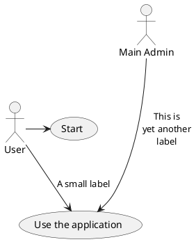

# Architecture Design

## Purpose

Assuming this application will be served to millions of people. And assume we will be charged by [coinapi.io](https://docs.coinapi.io/) for the number of api calls made.

So minimizing charging fee for api calls and promising the scalability of the project in order to make sure further development job easier to go.

## Solution

### Brief Description

To minimize the times of api calls, we need to avoid the frontend requests the cloud api directly.

But the api need to show the realtime price of each cryptocurrency, we have to update the data in our database periodically.

So using the [Redis](https://redis.io/) to act as cache, and the server will request the latest data from [coinapi.io](https://docs.coinapi.io/) every **10 seconds** by running Linux **crontab** order.

The frontend request will go to this backend directly and we can modify the raw data from cloud api to fulfill our requirement.

### UML



## Folder Structure

```
 src
  ├── api
  │   └── v1
  ├── configs
  ├── controllers
  ├── core
  ├── middlewares
  ├── models
  ├── services
  ├── types
  └── utils
```

This server uses [M-V-C](https://en.wikipedia.org/wiki/Model%E2%80%93view%E2%80%93controller) structure and [Domain Driven Design](https://en.wikipedia.org/wiki/Domain-driven_design) to build up the folder structure.

- api -> store the routers, which are written in RESTful style.
- configs -> store some basic config, like http exception, site config and so on.
- controllers -> the controllers for corresponding routes in order to response the request.
- core -> the initializer of the whole application, including application, middleware and router loading.
- middleware -> the middleware to handle the request.
- models -> the models of data.
- services -> the services to get data from database.
- types -> the types for each domain.
- utils -> common utils function used in the project.

# Tech Stack

## Packages

- [Koa.js](https://koajs.com/)
  - [Koa Router](https://github.com/ZijianHe/koa-router)
  - [Koa CORS](https://github.com/koajs/cors)
  - [Koa Logger](https://github.com/koajs/logger)
  - [Koa BodyParser](https://github.com/koajs/bodyparser)
- [TypeScript](https://www.typescriptlang.org/)
- [Redis](https://redis.io/)

## Dev Dependencies

- [Nodemon](https://nodemon.io/)
- [ESLint](https://eslint.org/)
- [Prettier](https://prettier.io/)
- [CommitLint](https://commitlint.js.org/)
- [Husky](https://typicode.github.io/husky/)

# Startup

1. Run the following command under the project root path.

```bash
cp ./.env ./.env.development
```

After copying the dotenv file template, you need to fill the corresponding config in the new dotenv file.

2. Install dependencies via pnpm.

```bash
pnpm i
```

3. Start the dev server.

```bash
pnpm dev
```

# FAQ

## Git hooks are not set as executable warning

If terminal console prints message: `hint: The '.husky/commit-msg' hook was ignored because it's not set as executable.`, pls run the following command in terminal. Let the package husky grants the access to run.

```bash
chmod ug+x .husky/*
chmod ug+x .git/hooks/*
```
